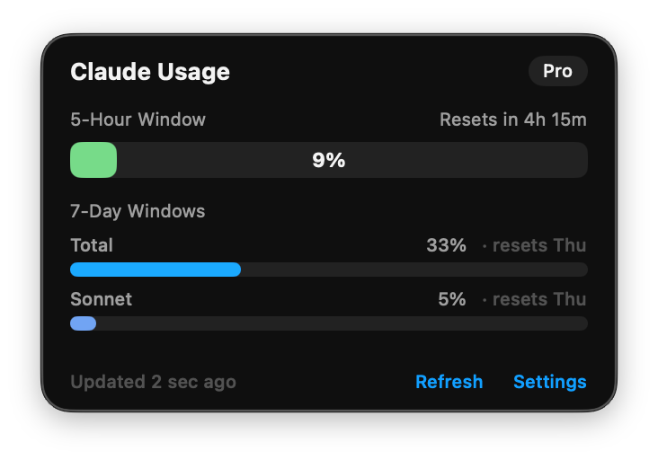

# ClaudeBar

A native macOS menu bar app that shows your Claude.ai usage at a glance.



## Features

- **Menu bar indicator** -- ring icon with percentage fills and changes color as usage increases
- **5-hour rolling window** -- progress bar with reset countdown
- **7-day limits** -- separate bars for total, Sonnet, and Opus utilization
- **Subscription detection** -- automatically identifies Pro / Max tier
- **Auto-refresh** -- polls every 5 minutes, manual refresh available
- **Secure storage** -- session key stored in macOS Keychain

## Requirements

- macOS 14 (Sonoma) or later
- Swift 5.9+
- Claude Pro or Max subscription

## Install

Download the latest `.zip` from [Releases](https://github.com/chiliec/claudebar/releases), unzip, then:

```bash
xattr -cr ClaudeBar.app
mv ClaudeBar.app /Applications/
```

The `xattr -cr` command removes the macOS quarantine flag — required for apps distributed outside the App Store.

### Build from source

```bash
git clone https://github.com/chiliec/claudebar.git
cd claudebar
./scripts/bundle.sh
cp -r .build/release/ClaudeBar.app /Applications/
```

## Setup

1. Open [claude.ai](https://claude.ai) in your browser
2. DevTools (Cmd+Opt+I) -> Application -> Cookies
3. Copy the `sessionKey` value
4. Launch ClaudeBar and paste it in the setup screen

## Development

```bash
./scripts/run.sh          # build + sign + run
swift test                # run all tests
swift test --filter AppStateTests  # run one test suite
```

> **Note:** Do not use `swift run` -- the binary must be code-signed to access Keychain. Use `./scripts/run.sh` instead.

## How it works

ClaudeBar reads usage data from `claude.ai/api/organizations/{org_id}/usage` using your session cookie. It does not use any unofficial or undocumented endpoints beyond what the Claude.ai web app itself uses.

No data is sent anywhere except to `claude.ai`. Your session key never leaves your machine (stored in macOS Keychain).

## License

MIT
